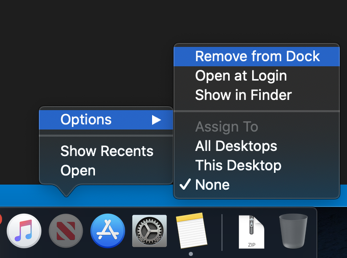

# new-mac-setup

Scripts and notes regarding tools/apps I install on new developer machines.

## Remove Crap from the Dock

On a clean macOS install there's going to be a bunch of stuff on the dock that you probably don't want. Get rid of it 😉!

## Install OS Updates

This is especially worthwhile with macOS Catalina being so new and lamentably buggy. It's especially important if you (like me 💪🏼) treated yourself to the new 16" MacBook Pro. Applying updates ASAP will ensure you have the latest drivers installed.

## Password Manager

Get your password manager installed. [I use 1Password, and I installed it from the App Store](https://apps.apple.com/us/app/1password-7-password-manager/id1333542190?mt=12).

## Content Blockers

I typically use Firefox Developer Edition for standard browsing. However, when I'm shopping online I use Safari if the site I'm using supports Apple Pay. I use [Better Blocker](https://apps.apple.com/us/app/better-blocker/id1121192229?mt=12) in that case.

## Homebrew

Install [homebrew](https://brew.sh/). 

1. Open up your terminal 
2. Run this: `/usr/bin/ruby -e "$(curl -fsSL https://raw.githubusercontent.com/Homebrew/install/master/install)"`

## Antigen
